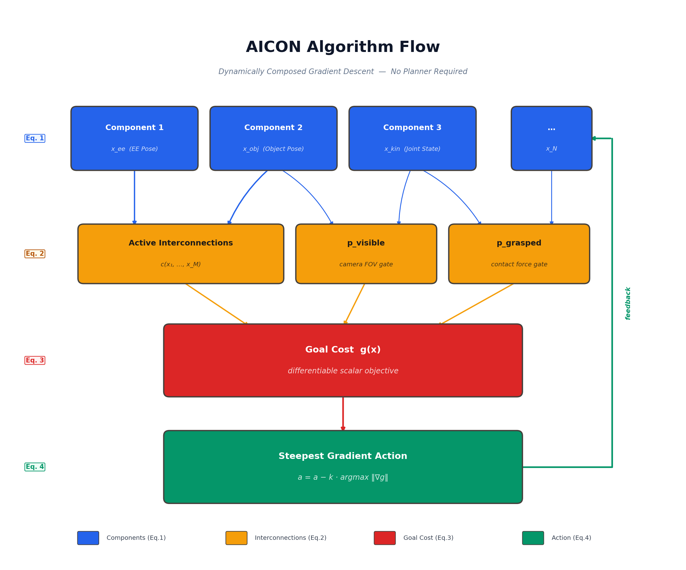
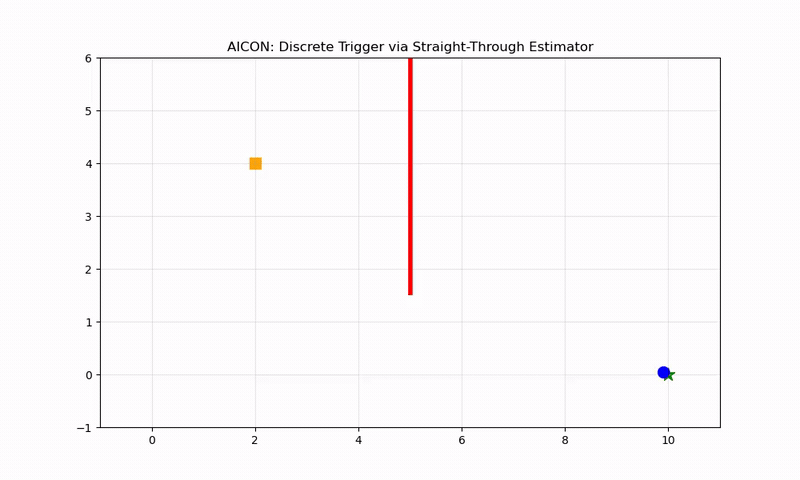
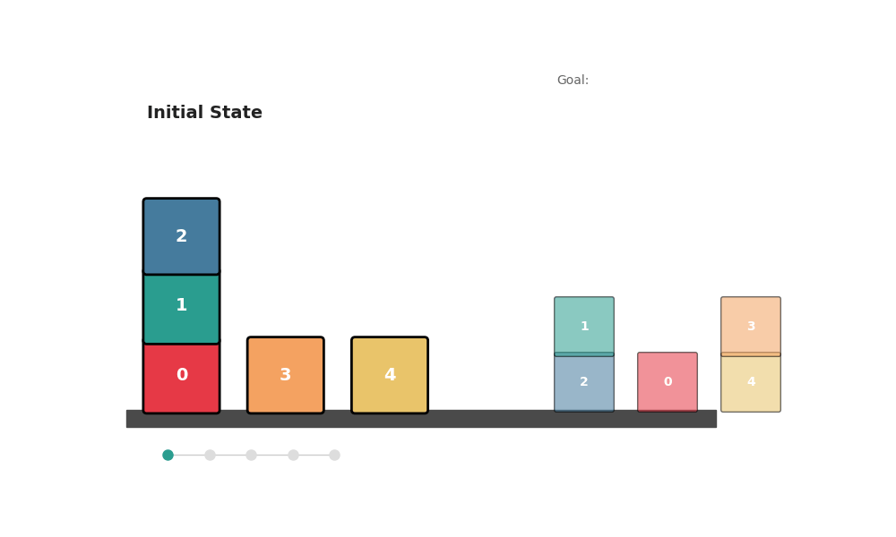

# AICON: No Plan but Everything Under Control

Implementation of **"No Plan but Everything Under Control: Robustly Solving Sequential Tasks with Dynamically Composed Gradient Descent"** ([Mengers & Brock, ICRA 2025 — arXiv:2503.01732](https://arxiv.org/abs/2503.01732)) inside Isaac Lab.

Read the companion article on Medium: [Paper Review: No Plan but Everything Under Control](https://medium.com/@me_51393/paper-review-no-plan-but-everything-under-control-15813dee96f2)

---

## The Core Idea

Most robotic manipulation pipelines use hierarchical planners, state machines, or learned policies to sequence sub-goals. AICON (Active InterCONnect) eliminates all of these. It replaces planning with pure gradient descent through a dynamically composed differentiable cost function, and the correct sub-goal ordering emerges automatically from the math.

The key insight from the paper: if you compose your goal, sensors, and physical constraints as a single differentiable graph, then gradient descent will implicitly discover and sequence sub-goals without any explicit planning module.

---

## Algorithm Architecture



The algorithm has four layers, each corresponding to an equation in the paper:

### 1. Components as Recursive Estimators (Eq. 1)

Each physical quantity (end-effector pose, object pose, joint state) is a local differentiable estimator:

```
x_t = f(x_{t-1}; c_1, c_2, ..., c_N)
```

In code, this is a PyTorch module that maintains a state estimate and propagates gradients:

```python
# From source/no_plan_everything_control/aicon/components.py
class Component:
    """A single differentiable state estimator (Eq. 1)."""
    def __init__(self, name: str, state: torch.Tensor, device: torch.device):
        self.name = name
        self.state = state.clone().detach().requires_grad_(True).to(device)
```

### 2. Active Interconnections (Eq. 2)

Connections between components gate gradient flow based on the environment state. These are the paper's "likelihoods" — differentiable scalars like `p_visible` (is the handle in the camera FOV?) and `p_grasped` (is the gripper holding the object?):

```
c(x_1, x_2, ..., x_M)  —  implicit differentiable coupling
```

In the Locked Door demo, this is implemented as:

```python
def gate_open_prob(self, pos):
    """Active Interconnection (Eq. 2): c_gate = f(||x - button||)"""
    dist_to_button = torch.norm(pos - self.button_pos)
    return torch.exp(-0.5 * dist_to_button)
```

The gate probability modulates the barrier cost — when far from the button, the gate is closed and the barrier is impassable. When near the button, the gate opens and the agent can pass through.

### 3. Goal as Differentiable Cost (Eq. 3)

All sub-costs are composed into a single differentiable scalar:

```python
def compute_cost(self, pos):
    """Composed goal function g(x) (Eq. 3)"""
    goal_cost = torch.norm(pos - self.goal_pos)
    c_gate = self.gate_open_prob(pos)  # interconnection modulation
    barrier_cost = 100.0 * torch.exp(-0.5 * ((pos[0] - gate_x) / 2.0)**2)
    return goal_cost + (1.0 - c_gate) * barrier_cost
```

### 4. Steepest Gradient Action Selection (Eq. 4)

The action at each step is simply the normalized gradient of the composed cost:

```
a_{t+1} = a_t - k * argmax_{nabla g} ||nabla g(a_t)||
```

```python
cost = self.compute_cost(self.agent_pos)
cost.backward()  # backward pass enumerates ALL gradient paths
grad_normalized = grad / torch.norm(grad)
self.agent_pos -= lr * grad_normalized  # steepest descent step
```

No search, no branching, no planner. The backward pass through `torch.autograd` automatically finds the steepest available gradient path, which implicitly sequences sub-goals.

---

## Visual Results

### Locked Door: Implicit Sub-Goal Sequencing

A point mass must reach a goal at (10, 0), but a barrier blocks the path at x=5. A button at (2, 5) opens the barrier. AICON's gradient descent automatically routes the agent to the button first, then through the opened gate to the goal — with zero explicit planning:



The trajectory bends upward toward the button (orange square) to open the gate, then proceeds through the barrier (red line) to the goal (green star).

### Blocks World: Complex Multi-Step Rearrangement

The classic AI planning benchmark. Given an initial block configuration and a goal arrangement, AICON computes the correct sequence of stack/unstack operations purely from gradient descent through the differentiable state equations (Eqs. 5-8 in the paper):



The key equations for Blocks World:

```
c_t(X) = 1 - (1/|B|) * sum_{Y in B} o_t(Y, X)          — is X clear?      (Eq. 5)

o_t(X,Y) = o_{t-1}(X,Y)
         + c_{t-1}(X) * c_{t-1}(Y) * a_stack(X,Y)       — stack update
         - c_{t-1}(X) * a_unstack(X,Y)                   — unstack update   (Eq. 6)
```

The gradient of the goal cost automatically determines whether to stack or unstack at each step, and which blocks to move — no BFS, no A*, no heuristic.

---

## Running the Code

### Installation

```bash
cd /path/to/IsaacLab
./_isaac_sim/python.sh -m pip install -e /path/to/no_plan_everything_control
```

### Mathematical Demos (no Isaac Lab required)

These demos run with standard Python + PyTorch + matplotlib:

```bash
# Interactive notebook with both Locked Door and Blocks World demos
jupyter notebook scripts/simple_demos/AICON_Math_Demo.ipynb

# Standalone Blocks World GIF generator
python scripts/simple_demos/matplotlib_blocks_video.py

# 2D Locked Door trajectory plot
python scripts/simple_demos/demo_2d_locked_door.py
```

### Isaac Lab Physical Simulation

These require NVIDIA Isaac Lab with GPU:

```bash
# Blocks World with physical rigid bodies
cd /path/to/IsaacLab
./isaaclab.sh -p /path/to/no_plan_everything_control/scripts/simple_demos/isaac_blocks_video_lab.py --enable_cameras

# Drawer Manipulation with Franka Panda arm (headless recommended)
./isaaclab.sh -p /path/to/no_plan_everything_control/scripts/run_drawer_manipulation.py --headless
```

The mathematical demos and Isaac Lab demos are independent — neither requires the other.

---

## Repository Structure

```
source/no_plan_everything_control/
  aicon/                    Pure PyTorch AICON kernel (framework-agnostic)
    components.py           Recursive estimators (Eq. 1)
    interconnections.py     Active interconnections (Eq. 2)
    gradient_descent.py     Steepest gradient action selection (Eqs. 3-4)
  envs/
    blocks_world/           Experiment 1: symbolic block rearrangement
    drawer_manipulation/    Experiment 2: Franka drawer opening
scripts/
  simple_demos/             Matplotlib and notebook visualizations
  run_blocks_world.py       Isaac Lab blocks world entry point
  run_drawer_manipulation.py  Isaac Lab drawer entry point
tests/                      Unit tests for AICON math
```

---

## Testing

```bash
cd /path/to/IsaacLab
./_isaac_sim/python.sh -m pytest /path/to/no_plan_everything_control/tests/ -v
```

---

## Citation

```bibtex
@inproceedings{mengers2025noplan,
  title={No Plan but Everything Under Control: Robustly Solving Sequential Tasks
         with Dynamically Composed Gradient Descent},
  author={Mengers, Vincent and Brock, Oliver},
  booktitle={IEEE International Conference on Robotics and Automation (ICRA)},
  year={2025}
}
```
